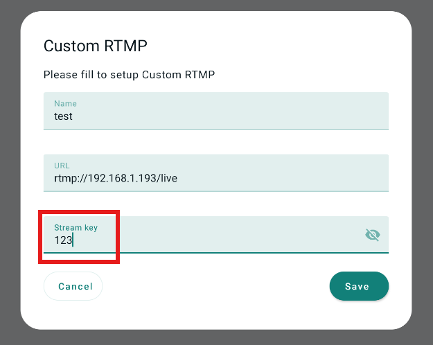
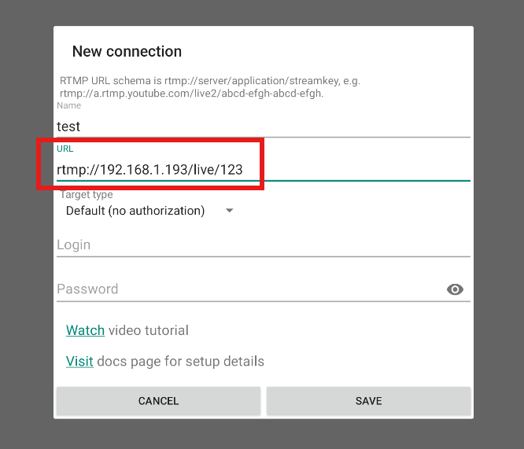

# App Configuration

We carefully control the runtime workloads of the apps. To replicate the evaluation, you need to configure the resources and settings for the following apps.

## UHD video and 360 video

We play local videos instead of network videos during evaluation, in order to prevent network variations from affecting the results. You can download the videos [here](https://drive.google.com/drive/folders/1fKdt2Vkl85X0q-GxcRm13p6N2T_ROb2d?usp=sharing). After downloading, push the videos into the emulator, using `adb push PATH_TO_VIDEO /sdcard/Download/`.

For UHD video apps, please play videos with `uhd_` prefix; for 360 videos, please use videos with `360_` prefix.

## Livestream

For similar reasons, livestream apps also need to stream to a local network. Therefore, we need to first set up a livestream server app, which is responsible for receiving and displaying the live video feed. We use `nginx`, a popular web server, as the livestream server app. We use `RTMP` as the livestream protocol, as it is universally supported by livestream platforms.

To prevent the server app from influencing evaluation results, it is hosted in a dedicated machine connected to the evaluation PC via ethernet (see [here](setup.md#livestream-server) for hardware configuration). Please configure the server app as follows.

* **Windows.** Download the prebuilt `nginx` binary with RTMP support [here](https://github.com/illuspas/nginx-rtmp-win32/archive/refs/heads/dev.zip). Unzip the file and click on `nginx.exe` to start the server. You can verify that the server is running by opening `http://localhost:8080` in your browser.

* **Linux.** 

  - Begin by running the following commands as a non-root user to update your package listings and install the Nginx module.

    ```shell
    sudo apt update
    sudo apt install libnginx-mod-rtmp
    ```

  - Using `nano` or your favorite text editor, open Nginx’s main configuration file, `/etc/nginx/nginx.conf`, and add this configuration block to the end of the file.

    ```shell
    sudo nano /etc/nginx/nginx.conf
    ```

    ```conf
    . . .
    rtmp {
        server {
            listen 1935;  # RTMP port
            chunk_size 4096;
    
            application live {
                live on;
                record off;
            }
        }
    }
    ```

    - `application live` defines an application block that will be available at the `/live` URL path.
    - `live on` enables live mode so that multiple users can connect to your stream concurrently, a baseline assumption of video streaming.

  - Now you can reload Nginx with your changes.

    ```shell
    sudo systemctl reload nginx.service
    ```

    If your Nginx service is not on, simply use the command below.

    ```shell
    sudo nginx
    ```

  - You can test your service with your local video file. To stream it, install `ffmpeg`.

    ```bash
    sudo apt install ffmpeg
    ```

    And use `ffmpeg` to send it to your RTMP server. Find any video you like or just use the videos [here](https://drive.google.com/drive/folders/1fKdt2Vkl85X0q-GxcRm13p6N2T_ROb2d?usp=sharing) for testing. `input.mp4` is the video name. Change it to the file name you actually use.

    ```bash
    ffmpeg -re -i input.mp4 -c:v libx264 -f flv rtmp://localhost/live/stream
    ```

    Now you can use video players like VLC to watch your video stream with the url `rtmp://localhost/live/stream` to check your RTMP service.


After setting up the server, please configure the streaming settings in the livestream app. If the app asks for an RTMP url and a stream key, enter the url as `rtmp://SERVER-IP-ADDRESS/live`, and the stream key to be `123`. You can set other stream keys as well; just make sure to enter the same stream key when measuring FPS in the next section.



If the app does not have a dedicated field for stream key, append the stream key to the RTMP url (e.g., `rtmp://SERVER-IP-ADDRESS/live/123`), as shown in the picture below.



Do not forget to configure the streaming resolution to be `3840×2160` / `Match display` and frame rate to be `60` as well. These options are usually found in the app settings.


