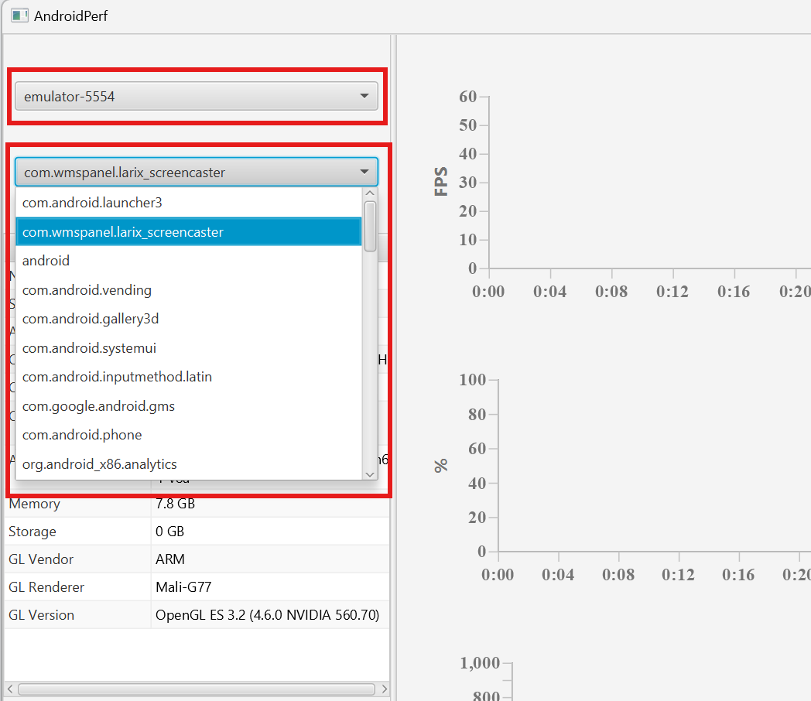
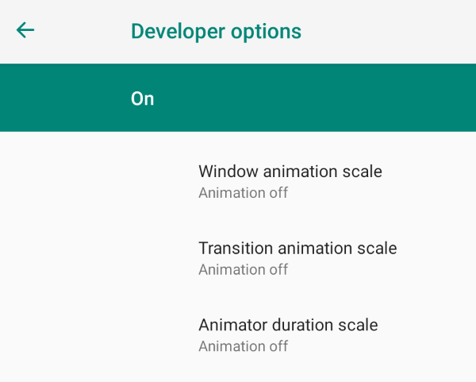

# Evaluation Guide

This document guides you to reproduce the experimental results in our paper.

## 1. Emulator Configuration

### vSoC configuration

If you followed the artifact README to run vSoC, the emulator is already configured with the same parameters that we use to carry out the evaluation.

More concretely, vSoC is configured with a 8-core virtual CPU, 8 GB memory, 32 GB storage and a UHD (3840×2160) display. We changed the device model of vSoC to a Samsung Galaxy model to avoid emulator detection, so some mobile apps may report vSoC as a Samsung Galaxy phone.

In our paper, we run the evaluations on five other mainstream emulators to compare their performance with vSoC. If you want to do it as well, please follow [this guide](other-emulators.md) to install the emulators.

### 2. Running the Apps

A total of 50 emerging apps are involved in the evaluation. The complete list of apps is provided [here](app.md).

Most apps can be downloaded from the Google Play store bundled with the emulators. In some rare cases, apps might not show up in Google Play. You can instead use [Apkpure](https://apkpure.com/) to download the `.apk` package of the app, and install it via adb: `adb install SOME_PACKAGE_NAME.apk`.

We carefully control the runtime workloads of the apps. If you want to fully replicate the configurations that we use during evaluation, you can follow [this guide](app-configuration.md).

### 3. Measurement Setup

To allow for precise reproduction, the measurement of app performance is carried out with rigorness.

#### FPS measurement

FPS measurement of the apps (except livestream apps) are done with [AndroidPerf](https://github.com/andylin-hao/AndroidPerf), a Android profiling tool that parses FPS data by using the `dumpsys` command available from the adb shell. We use `AndroidPerf` instead of other tools (e.g., `PerfDog` or `Solopi`), because it can reliably show FPS in apps with multiple rendering surfaces, which AR apps usually do.

To use the tool, please download it [here](https://github.com/andylin-hao/AndroidPerf/releases/download/AndroidPerf-Release/AndroidPerf_Win.zip) and unzip it. Click `AndroidPerf.exe` to start the profiler. As shown in the figure below, please select the emulator in the first dropdown widget, and select the target app in the second dropdown widget. Click `Start` at the bottom to begin measuring.

Note: if you do not see anything in the dropdown widgets, please make sure that you have connected to the emulator through adb. You can check your connection with `adb devices`. If still nothing shows up, kill your adb server (`adb kill-server`) and retry.



FPS measurement of livestream apps is a little different, because the frame rate of the livestream video feed is different from the FPS of the app.
When measuring app FPS, we only take the frame rate of the *foreground* app window into account. When livestream apps stream in the *background*, it has no foreground window (so the FPS is 0), but the video stream is still continuously feed to the RTMP server.

We measure the FPS of the video feed by using an [instrumented version](https://github.com/VirtualSoC/FFmpeg) of `ffmpeg` to play the stream and record the number of frames played. You can download the prebuilt binary [here](todo) for windows and [here](todo) for Linux, on the server machine.

When the livestream server is running and the app is streaming, you can use the following command to start recording FPS.

```bash
ffplay.exe -f live_flv -fast -x 1280 -y 720 -fflags nobuffer -flags low_delay -strict experimental -vf "setpts=N/60/TB" -af "asetpts=N/60/TB" -noframedrop -i "rtmp://localhost:1935/live/123" 
# 123 is the stream key. make sure that it matches the stream key you configure in the app.
```

#### Latency measurement

To measure motion-to-photon latency, we use a high-speed camera to record videos of user interactions with the apps with a frame rate of 2000 FPS at Full-HD. We position the camera at the side of the device screen, so that both user actions and the computer screen can be clearly observed. The following figure demonstrates the measurement setup.


Note: considering that professional high-speed cameras can be expensive, you can use the slow motion mode of smartphone cameras for a rough measurement. High-end smartphones can provide a capture frame rate of 480 FPS, and from our experience, they typically incur <20 *ms* of error.

To ease recognition of user actions, for camera and AR apps, we use flashlights to produce sudden luminance changes on camera streams. For livestream apps, we flash the screen contents of the emulators using the built-in developer tools of Android. More concretely, we turn off all Android animations, so every UI change of the Android system will be sudden and easier to recognize.



For the recorded videos, we examine each frame to recognize the timestamp when the user action happens, as well as the timestamp when the corresponding response of the action manifests. In this way, the motion-to-photon latency can be calculated as the time delta of the two timestamps, with a negligible error of up to two frames (1.0 ms) introduced by the camera.
