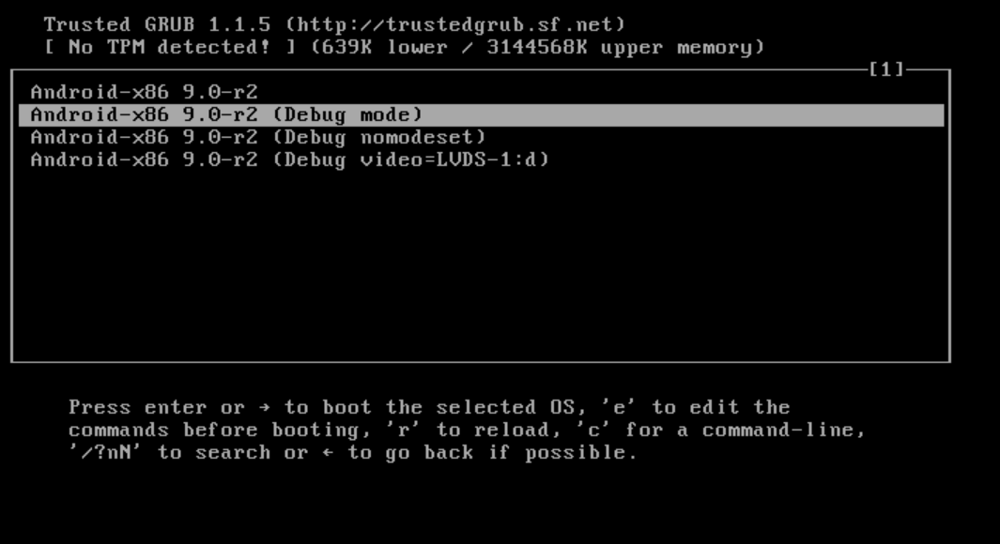
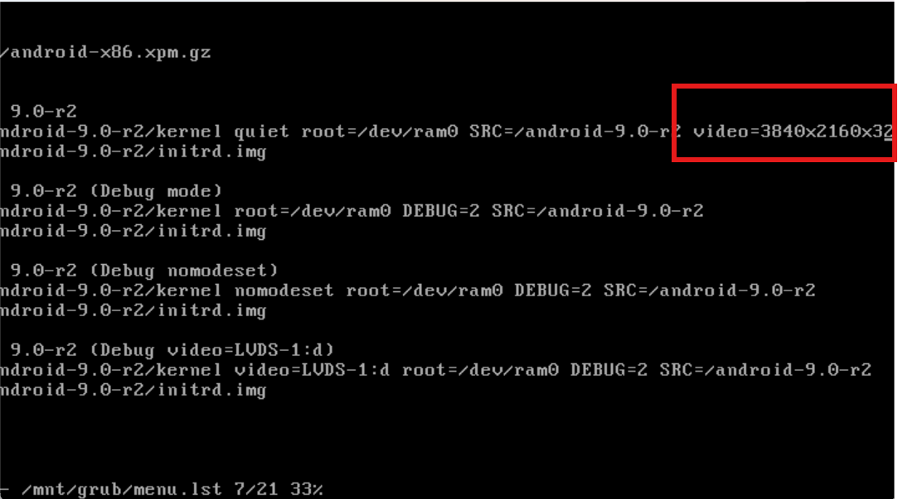
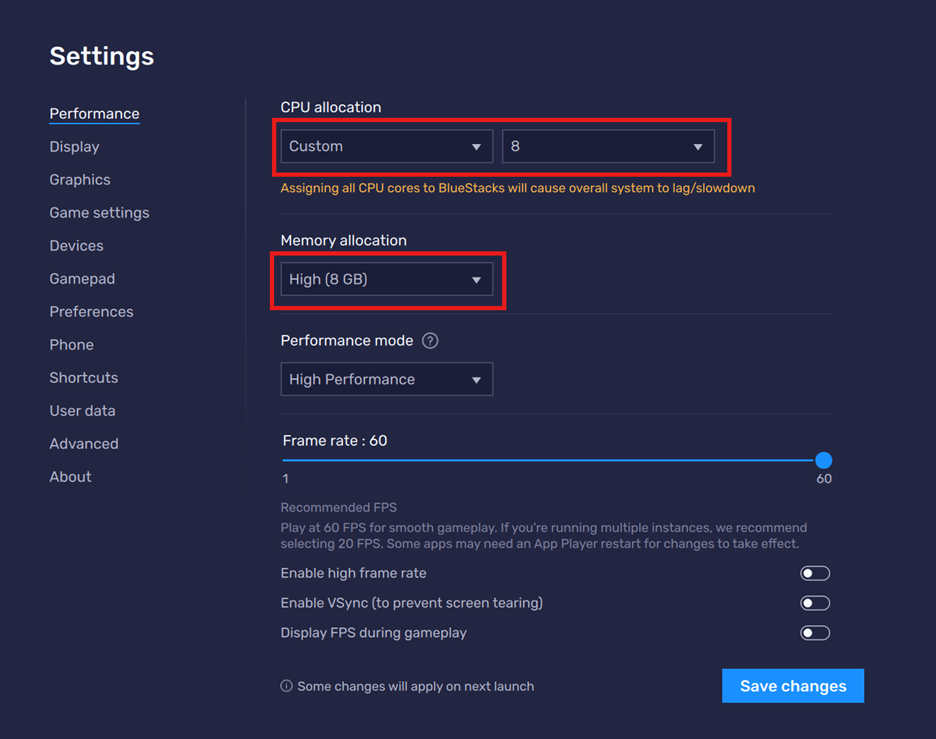
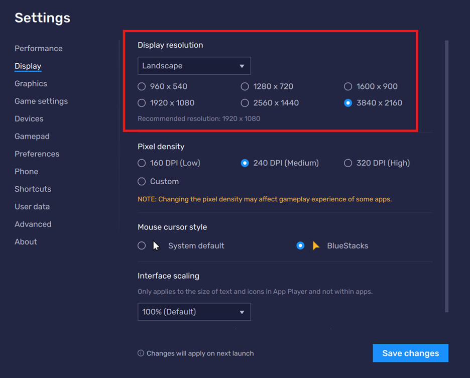
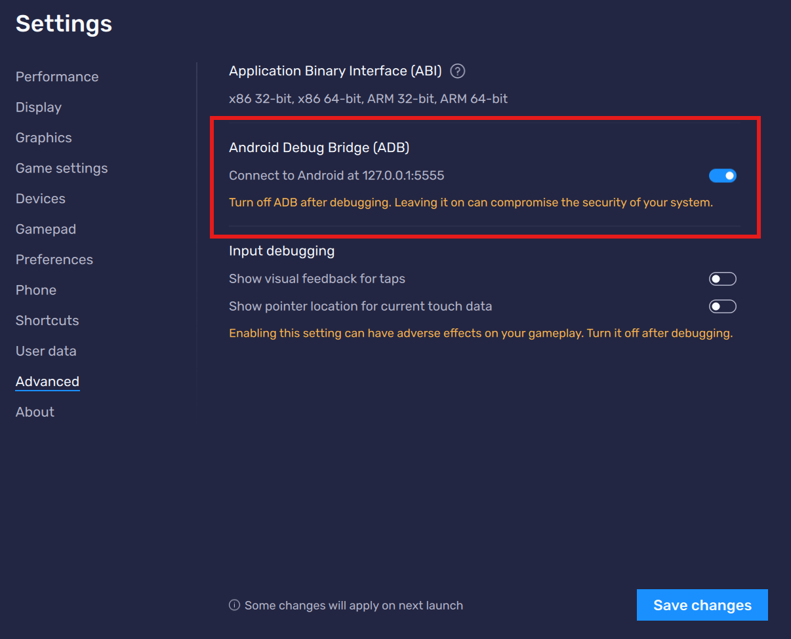
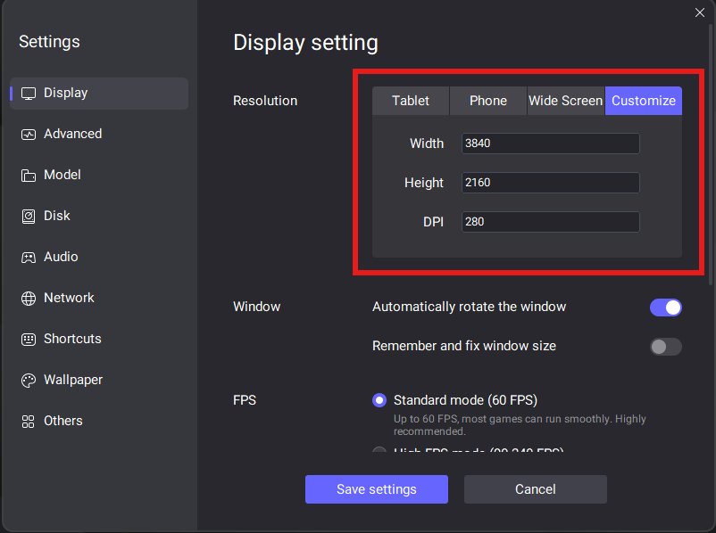
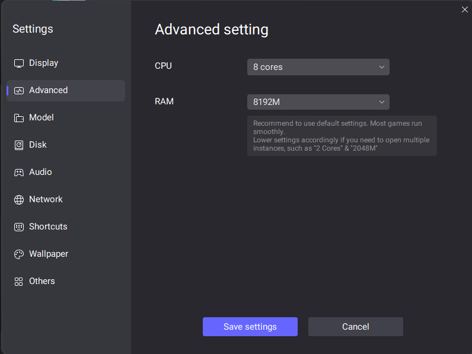
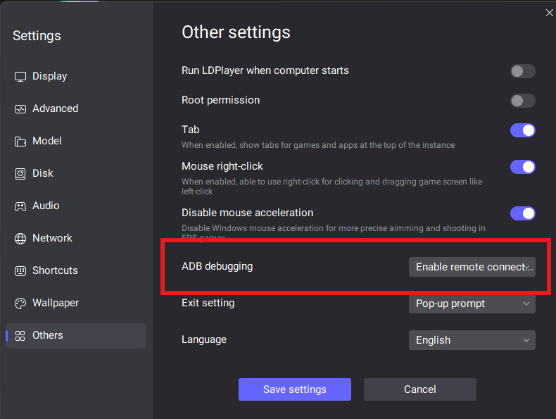

# Other emulators

Besides vSoC, our paper also evaluates five other mainstream mobile emulators, including Google Android Emulator, QEMU-KVM, LDPlayer, Trinity and Bluestacks.

If you want to repeat the experiments on the other emulators and compare the results, you need to install the five emulators and configure them as well. If not, please continue to [Running the Apps](evaluation.md#2-running-the-apps).

## Google Android Emulator (GAE)

#### Download

Google has provided a detailed guide on installing and running GAE, please refer to https://developer.android.com/studio/run/emulator. Installing Android Studio is the easiest way to use GAE.

#### Configuration

When creating a virtual device on GAE (see the official [guide](https://developer.android.com/studio/run/managing-avds)), we recommend you choose the Android 13 image, which is the most widely-deployed Android version at the time of evaluation. You should configure the hardware profile (click `Show advanced settings` on the hardware profile configuration page) to a 8-core CPU, 8-GB memory, 32-GB storage, and 3840×2160 display.

#### ADB Connection

ADB connection is automatically established when GAE boots.

## QEMU-KVM

QEMU-KVM runs only on Linux! You need to set up a Linux machine to run QEMU-KVM.

#### Download 

The QEMU installed through package managers like `apt` are often old. We provide a build and installation guide of QEMU 7.2 below.

```bash
sudo apt install ninja-build libsdl2-dev libpixman-1-dev libvirglrenderer-dev libepoxy-dev libgbm-dev
git clone https://gitlab.com/qemu-project/qemu.git
cd qemu
git checkout stable-7.2
git submodule update --recursive
./configure --target-list=x86_64-softmmu
make -j$(nproc)
sudo make install
```

KVM support is also vital to the performance of QEMU-KVM. In terminal, type `egrep -c '(vmx|svm)' /proc/cpuinfo` to check whether your CPU supports KVM (a number greater than 0 means we have KVM support). Type ```sudo adduser `id -un` kvm``` to add the user to the KVM group.

#### Configuration
 
Download the [Android-x86_64 9.0 ISO Image](https://sourceforge.net/projects/android-x86/files/Release%209.0/android-x86_64-9.0-r2.iso/download). Type `qemu-img create -f qcow2 hda.img 32G` to create an image file alongside the downloaded ISO file. 

To run QEMU-KVM with USB camera support, replace `X` and `Y` in the follow command with the bus and addr ID of your camera (which can be queried using [this guide](https://stackoverflow.com/a/58583288)), and execute the command at the directory where you store the IMG and ISO files.

```bash
qemu-system-x86_64 \
-enable-kvm \
-m 8192 \
-smp 8 \
-cpu host \
-device intel-hda \
-machine usb=on -device usb-kbd \
-boot menu=on \
-net nic \
-net user,hostfwd=tcp::5555-:5555 \
-device virtio-gpu-pci \
-display sdl,gl=on \
-hda hda.img \
-cdrom android-x86_64-9.0-r2.iso \
-serial mon:stdio \
-usb \
-device usb-ehci,id=ehci \
-device usb-host,hostbus=X,hostaddr=Y
```

Please follow [Trinity's guide](https://github.com/TrinityEmulator/TrinityEmulator/wiki/Guest-OS-Installation-Guide) to install Android-x86. Afterwards, change Android's screen resolution following the instructions below.

* When vSoC boots it should show a boot option list. Select the `Debug mode` boot option.



* Press enter and you'll see a terminal-like interface. Type `mount -o remount,rw /mnt` and `vi /mnt/grub/menu.lst`.

* Edit configurations in `vi`. Type `i` to edit, and in the first option list (below the line `title Android-x86 9.0-r2`) insert `video=3840x2160x32`. Then press ESC and type `:wq` to save the configurations.



* Enter `reboot -f` to reboot the system. After entering Android, open the `Terminal Emulator` app built in the system, enter `su` and grant the app superuser privileges. Then, type `wm size 3840x2160`, to have the Android system pick up the resolution changes.

After you have booted/installed the system, you may want to turn on Intel Houdini to support ARM-based mobile apps. To this end, open the Terminal Emulator app, enter `su`, and then type `enable_nativebridge` to turn on Houdini.

#### ADB Connection

Establish ADB connection through `adb connect 127.0.0.1:5555`.

## Bluestacks

#### Download

Follow the link: https://www.bluestacks.com/bluestacks-5.html.

#### Configuration

After booting the emulator, enter settings. Edit the settings as suggested by the figure below, and reboot afterwards.





#### ADB Connection

First, you need to make sure adb permission has been turned on as shown in the figure below. Then, establish adb connection with the command `adb connect 127.0.0.1:5555`.



## Trinity

#### Download

Download Trinity [here](https://github.com/TrinityEmulator/TrinityEmulator/releases/tag/Trinity-Release). Extract the ZIP file, open a Windows terminal in the extracted folder, and paste the command below to run. 

```bash
.\\x86_64-softmmu\\qemu-system-x86_64.exe -accel whpx -cpu android64 -m 8192 -smp 8 -machine usb=on -device usb-kbd -device usb-tablet -boot menu=on -soundhw hda -net nic -net user,hostfwd=tcp::5555-:5555 -device direct-express-pci -display sdl -hda hda.img -cdrom android_x86_64.iso
```

Then, follow the [official guide](https://github.com/TrinityEmulator/TrinityEmulator/wiki/Guest-OS-Installation-Guide) to install the guest OS.

#### Configuration

CPU cores / memory size have already been configured via the command line options above. To change screen resolution, please follow the [QEMU-KVM configuration guide](#qemu-kvm) above.

## LDPlayer

#### Download

Follow the link: https://en.ldplayer.net/ and download LDPlayer 9 (the newest version).

#### Configuration

After booting the emulator, enter settings. Edit the settings as suggested by the figure below, and reboot afterwards.





#### ADB Connection

First, you need to make sure adb permission has been turned on as shown in the figure below. Then, establish adb connection with the command `adb connect 127.0.0.1:5555`.


